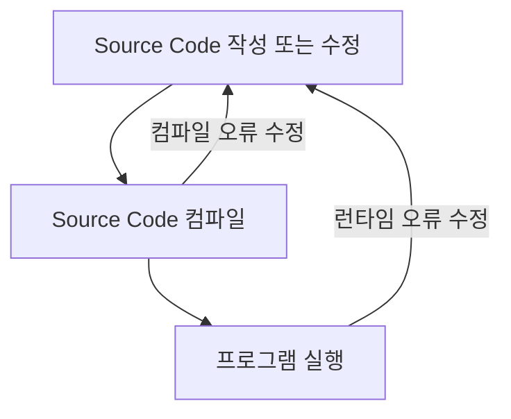

```mermaid
flowchart TD
    node1[Source Code 작성 또는 수정]
    node2[Source Code 컴파일]
    node3[프로그램 실행]

    node1 --> node2
    node2 --> node3
    node2 -->|컴파일 오류 수정| node1
    node3 -->|런타임 오류 수정| node1
```